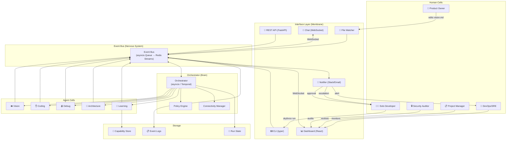

# Interaction Layer Specification — The Membrane & Synapses

## Purpose

This document defines **how human cells and agent cells actually talk to
each other** — the design principles, technology stack, protocols,
frameworks, and patterns needed to make the organism's nervous system
carry signals between biological and digital components.

---

## Part 1 — Design Principles

### 1. Async-First, Sync When Needed

Human cells are slow (hours/days). Agent cells are fast (seconds).
The default interaction is **asynchronous** — humans drop input and
agents emit output without blocking on each other.

Synchronous interaction is reserved for:
- Deployment approvals (human must say "yes" before deploy proceeds)
- Escalations marked `urgency: immediate`
- Interactive debugging sessions

**Implication:** Every interface needs a queue or inbox, not a live socket.

### 2. Event-Driven, Not Request-Response

Humans don't call agents. Humans **emit events** (via UI, CLI, file edits).
Agents don't call humans. Agents **emit events** (via event bus).
The orchestrator matches events to subscribers.

```
Human writes docs/vision/product_vision.md
    → file_watcher detects change
    → emits: vision.updated {path: "docs/vision/product_vision.md"}
    → orchestrator routes to vision_agent
```

**Why:** This decouples interaction from implementation. The human
doesn't need to know which agent handles their input.

### 3. Structured Contracts at Every Boundary

Every human↔agent exchange must pass through a **schema-validated
contract**. No raw free-text between components. Even natural language
inputs are wrapped in an envelope:

```json
{
  "envelope_type": "human_input",
  "source_role": "product_owner",
  "timestamp": "2026-03-13T02:00:00Z",
  "format": "natural_language",
  "content": "The login page should support social auth",
  "context_ref": "TASK-002"
}
```

### 4. Progressive Disclosure

Humans get **summaries first, details on demand**.
- Dashboard shows: `✅ 3/5 tasks complete, ❌ 1 failed, ⏳ 1 in progress`
- Click through for: full test results, agent health reports, event logs
- Never dump raw JSON on a human unless they ask

### 5. Least-Privilege Interfaces

Each role gets **only the interfaces it needs**:
- Product Owner → vision editor + feature review (no deployment controls)
- On-Call Engineer → code editor + test runner (no policy editing)
- Compliance Officer → read-only audit logs (no write access to anything)

### 6. Idempotent Human Actions

Repeating a human action must not cause duplicate work:
- Saving `docs/vision/product_vision.md` twice → only one vision_agent run
- Approving deployment twice → only one deploy
- Answering an escalation twice → second answer is ignored with acknowledgment

### 7. Graceful Degradation of Human Presence

The organism must function when humans are absent:
- **All present:** Full quality, human-approved deploys, reviewed outputs
- **Reduced presence:** Auto-approve non-critical deploys, buffer escalations
- **No humans:** Run in safe mode — build and test, but never deploy; queue all escalations

---

## Part 2 — Technology Stack

### Core Language: **Python 3.11+**

| Why Python | Justification |
|---|---|
| Agent ecosystem | LangChain, LlamaIndex, CrewAI, Autogen — all Python-first |
| Async support | `asyncio` for event bus, `aiohttp`/`FastAPI` for APIs |
| JSON handling | Native dict ↔ JSON, `pydantic` for schema validation |
| Script interop | Easy to call shell scripts from `subprocess` |
| LLM SDKs | OpenAI, Anthropic, Google — all have Python SDKs |
| Ecosystem | Largest package ecosystem for ML/AI tooling |

### Framework: **FastAPI** (for the interaction layer HTTP surfaces)

```
pip install fastapi uvicorn pydantic
```

| Why FastAPI | Justification |
|---|---|
| Async native | Built on `asyncio` — matches event-driven design |
| Auto-docs | Swagger/OpenAPI docs generated from Pydantic models |
| Type safety | Pydantic models enforce schemas at runtime |
| WebSocket support | Built-in for real-time dashboard updates |
| Lightweight | No heavy ORM or templating overhead |

### Event Bus: **In-Process → Redis Streams (scaled)**

| Scale | Technology | Why |
|---|---|---|
| Solo / local | Python `asyncio.Queue` + NDJSON file persistence | Zero dependencies, works offline |
| Team / multi-instance | Redis Streams | Persistent, ordered, consumer groups, pub/sub |
| Enterprise | Apache Kafka | Exactly-once delivery, massive scale, replay |

Start with in-process. Migrate to Redis when you need multi-instance. The
event envelope schema stays the same regardless of transport.

### Schema Validation: **Pydantic v2**

```python
from pydantic import BaseModel, Field
from datetime import datetime
from typing import Literal

class EventEnvelope(BaseModel):
    event_id: str
    event_type: str
    source: str
    timestamp: datetime
    run_id: str | None = None
    payload: dict
```

Every input/output crosses a Pydantic model. Invalid data is rejected
before it reaches any agent. This is the **cell membrane** in code.

### Human Interfaces

| Interface Type | Technology | For Roles |
|---|---|---|
| **CLI** | `click` or `typer` (Python) | Solo Dev, Platform Admin, DevOps |
| **Web Dashboard** | React + Next.js + WebSocket | Project Manager, QA, all observers |
| **File Watchers** | `watchdog` (Python) | Product Owner, Tech Lead, Policy Author |
| **Notification** | Slack SDK / Email (SMTP) / Webhook | All escalation targets |
| **Chat Interface** | WebSocket + LLM gateway | Domain Expert, Product Owner |
| **API** | FastAPI REST endpoints | CI/CD, Ticketing, Monitoring systems |

### LLM Gateway (Agent Brains)

| Decision | Choice | Why |
|---|---|---|
| Abstraction layer | `litellm` | Unified API across OpenAI, Anthropic, Gemini, local models |
| Local fallback | `ollama` | Offline-capable LLM inference |
| Prompt management | Plain Markdown templates | Agents already defined as `.md` — use them directly |
| Token counting | `tiktoken` | Accurate budget enforcement |

### Storage

| What | Technology | Why |
|---|---|---|
| Event logs | NDJSON files → SQLite (scaled) | Simple, appendable, queryable |
| Run state | JSON files → SQLite | Resumable checkpoints |
| Capability store | JSON file → SQLite | Queryable memory |
| Artifacts | Filesystem (`artifacts/{run_id}/`) | Easy inspection |
| Policies | YAML files | Human-editable, version-controllable |
| Agent definitions | Markdown files | Human-readable specs |

### Orchestration Runtime

| Decision | Choice | Why |
|---|---|---|
| Workflow engine | `temporalio` (Python SDK) | Durable workflows, automatic retries, resumable |
| Lightweight alt | Custom Python with `asyncio` + state machine | Zero dependencies, full control |
| Task queue | `celery` with Redis broker (scaled) | Parallel agent execution |
| Lightweight alt | `asyncio.TaskGroup` | In-process parallelism, zero setup |

Start with custom `asyncio`. Migrate to Temporal when you need durable
cross-process workflows.

---

## Part 3 — Interaction Patterns

### Pattern 1: File-as-Interface (The Genome Pattern)

```
Human edits a file → file_watcher detects → event emitted → agent activates
```

Used by: Product Owner, Tech Lead, Policy Author, Schema Author

```python
# runtime/file_watcher.py
from watchdog.observers import Observer
from watchdog.events import FileSystemEventHandler

class VisionWatcher(FileSystemEventHandler):
    def on_modified(self, event):
        if event.src_path.endswith("product_vision.md"):
            event_bus.emit(Event(
                event_type="vision.updated",
                source="file_watcher",
                payload={"path": event.src_path}
            ))
```

**Design rules:**
- Debounce rapid saves (500ms window)
- Validate file content before emitting event
- Log the diff (what changed) for audit trail

---

### Pattern 2: CLI Command (The Nerve Impulse)

```
Human runs a command → CLI validates → event emitted → result streamed back
```

Used by: Solo Developer, Platform Admin, DevOps

```bash
# Example CLI commands
skyforce run feature_pipeline          # Start a workflow
skyforce status                        # Show run_state
skyforce approve deploy run-042        # Approve deployment
skyforce health                        # Show all agent health
skyforce escalations                   # List pending escalations
skyforce logs --run run-042            # View run event log
```

```python
# cli/main.py
import typer
app = typer.Typer()

@app.command()
def run(workflow: str):
    """Start a workflow pipeline."""
    event_bus.emit(Event(
        event_type="workflow.requested",
        source="cli",
        payload={"workflow": workflow}
    ))
    # Stream progress via WebSocket
    for event in event_bus.subscribe("workflow.*"):
        typer.echo(format_event(event))
```

---

### Pattern 3: Dashboard (The Diagnostic Display)

```
Agent emits events → WebSocket pushes to browser → UI renders in real-time
```

Used by: Project Manager, QA, Performance Analyst, all observers

```
┌─────────────────────────────────────────────┐
│  SkyForce Command Centre                    │
├──────────┬──────────────────────────────────┤
│ Pipeline │  [=====>        ] 3/5 tasks      │
│ Status   │  ✅ user-auth  ✅ task-crud      │
│          │  ❌ reminders  ⏳ notifications   │
│          │  ⬚ analytics                     │
├──────────┼──────────────────────────────────┤
│ Health   │  🟢 vision  🟢 coding           │
│          │  🟡 debug   🟢 arch  🟢 learn   │
├──────────┼──────────────────────────────────┤
│ Alerts   │  ⚠ 1 escalation pending         │
│          │  ⚠ Token usage at 78% budget    │
└──────────┴──────────────────────────────────┘
```

**Tech stack:**
- Backend: FastAPI WebSocket endpoint
- Frontend: React + `EventSource` or WebSocket
- State: Server-sent events from event bus → browser

---

### Pattern 4: Approval Gate (The Conscious Decision)

```
Agent reaches gate → OS pauses → notification sent → human approves/rejects → OS resumes
```

Used by: Approver, Solo Developer (for deploys)

```python
# runtime/approval_gate.py
class ApprovalGate:
    async def request_approval(self, action: str, context: dict) -> bool:
        request = ApprovalRequest(
            action=action,
            context=context,
            requested_at=datetime.now(),
            timeout=timedelta(hours=24)
        )
        # Persist request
        await self.store.save(request)
        # Notify human
        await notifier.send(
            role="approver",
            channel="slack",
            message=f"Approval needed: {action}",
            context=context
        )
        # Wait for response (async, non-blocking)
        return await self.store.wait_for_decision(
            request.id,
            timeout=request.timeout
        )
```

**Design rules:**
- Timeout defaults: 24h for deploys, 1h for security escalations
- Timeout behavior: configurable (auto-approve for staging, block for prod)
- Multiple approvers: configurable (any-of vs all-of)

---

### Pattern 5: Escalation (The Pain Signal)

```
Agent fails → emits agent.escalate → orchestrator routes to role → human responds → agent retries
```

Used by: On-Call Engineer, Domain Expert, Architecture Reviewer

```python
# runtime/escalation_router.py
ESCALATION_ROUTES = {
    "debugging_agent":     ["oncall_engineer"],
    "vision_agent":        ["domain_expert", "product_owner"],
    "architecture_agent":  ["architecture_reviewer", "tech_lead"],
    "coding_agent":        ["oncall_engineer", "tech_lead"],
}

async def route_escalation(event: Event):
    source = event.payload["source_agent"]
    targets = ESCALATION_ROUTES.get(source, ["solo_developer"])
    for role in targets:
        await notifier.send(
            role=role,
            urgency=event.payload.get("urgency", "next_session"),
            context=event.payload
        )
```

---

### Pattern 6: Chat Interface (The Conversation)

```
Human sends message → LLM interprets intent → maps to OS action → result returned
```

Used by: Domain Expert (clarifications), Product Owner (ad-hoc questions)

```python
# interfaces/chat.py
async def handle_chat(message: str, role: str):
    # Classify intent
    intent = await llm.classify(message, intents=[
        "clarify_requirement",
        "check_status",
        "approve_action",
        "modify_priority",
        "ask_question"
    ])
    
    if intent == "clarify_requirement":
        # Route answer to the agent that asked
        pending = await escalation_store.get_pending(role=role)
        await event_bus.emit(Event(
            event_type="escalation.resolved",
            payload={"escalation_id": pending.id, "answer": message}
        ))
```

---

### Pattern 7: Feedback Loop (The Learning Synapse)

```
Human reviews output → provides signal → learning_agent stores → future runs improve
```

Used by: QA (test quality), Tech Lead (code quality), Product Owner (feature accuracy)

```python
# interfaces/feedback.py
class FeedbackCollector:
    async def collect(self, run_id: str, role: str, feedback: dict):
        """
        feedback = {
            "task_id": "TASK-001",
            "signal": "positive" | "negative" | "correction",
            "category": "code_quality" | "test_coverage" | "feature_accuracy",
            "comment": "The auth module should use bcrypt, not MD5",
            "suggested_fix": "optional correction"
        }
        """
        await event_bus.emit(Event(
            event_type="feedback.received",
            source=f"human:{role}",
            payload=feedback
        ))
        # learning_agent subscribes to feedback.received
```

---

## Part 4 — Architecture Diagram



---

## Part 5 — Recommended Libraries Summary

| Layer | Library | Version | Purpose |
|---|---|---|---|
| **HTTP server** | `fastapi` | 0.110+ | REST + WebSocket endpoints |
| **Server runtime** | `uvicorn` | 0.29+ | ASGI server |
| **Schema validation** | `pydantic` | 2.6+ | Input/output contracts (cell membranes) |
| **CLI** | `typer` | 0.12+ | Developer-facing command line |
| **File watching** | `watchdog` | 4.0+ | File-as-interface pattern |
| **LLM abstraction** | `litellm` | 1.30+ | Multi-provider LLM calls |
| **Local LLM** | `ollama` | 0.1+ | Offline agent inference |
| **Token counting** | `tiktoken` | 0.7+ | Budget enforcement |
| **Event bus (scaled)** | `redis` | 5.0+ | Redis Streams pub/sub |
| **Workflows (scaled)** | `temporalio` | 1.4+ | Durable workflow execution |
| **Task queue (scaled)** | `celery` | 5.4+ | Parallel agent execution |
| **Dashboard frontend** | `react` | 18+ | Web UI |
| **Dashboard framework** | `next.js` | 14+ | SSR + API routes |
| **Notifications** | `slack-sdk` | 3.27+ | Slack alerts |
| **Testing** | `pytest` + `pytest-asyncio` | 8.0+ | Agent + integration tests |
| **Config** | `pyyaml` | 6.0+ | Policy + workflow files |
| **Logging** | `structlog` | 24.1+ | Structured JSON logging |

---

## Part 6 — Implementation Order

Build the interaction layer in this order (each step enables the next):

### Sprint 1: The Heartbeat (Week 1-2)
```
1. Pydantic models for EventEnvelope + all schemas from schemas.md
2. In-process event bus (asyncio.Queue + NDJSON persistence)
3. Basic CLI: skyforce run, skyforce status
4. File watcher for docs/vision/product_vision.md
```
**After this:** You can type `skyforce run feature_pipeline` and see events flow.

### Sprint 2: The First Organ (Week 3-4)
```
5. LLM gateway (litellm + ollama fallback)
6. Vision agent runtime (reads md, calls LLM, emits feature_plan.json)
7. Task split script (already exists, wire it into event bus)
8. Coding agent runtime (reads task, calls LLM, writes files)
```
**After this:** A vision document produces working code.

### Sprint 3: The Immune System (Week 5-6)
```
9. Policy engine (load YAML rules, evaluate conditions, emit verdicts)
10. Schema validation middleware (Pydantic at every input/output boundary)
11. Basic test runner integration (run_tests.sh → test_results.json)
12. Debugging agent runtime
```
**After this:** Bad code gets caught. Failing tests get auto-fixed.

### Sprint 4: The Senses (Week 7-8)
```
13. FastAPI server with WebSocket
14. React dashboard (pipeline status, agent health, escalation queue)
15. Approval gate mechanism
16. Notification system (Slack or email)
```
**After this:** Humans can watch and interact through a real UI.

### Sprint 5: The Memory (Week 9-10)
```
17. Learning agent runtime
18. Capability store read/write integration for all agents
19. Feedback collection endpoints
20. Event log viewer in dashboard
```
**After this:** The organism learns and improves across runs.

---

## Part 7 — Key Design Decisions to Make

| Decision | Options | Recommendation | When to Decide |
|---|---|---|---|
| LLM provider | OpenAI / Anthropic / Gemini / Local | Start with `litellm` wrapping whatever you have; add `ollama` for offline | Sprint 2 |
| Event bus transport | In-process / Redis / Kafka | In-process now; Redis when multi-user | Sprint 1 (start simple) |
| Workflow engine | Custom asyncio / Temporal / Prefect | Custom asyncio first; Temporal for durability later | Sprint 2 |
| Dashboard | React / Svelte / plain HTML | React + Next.js (ecosystem, SSR, WebSocket support) | Sprint 4 |
| Auth for dashboard | None / API key / OAuth | API key for solo; OAuth for team | Sprint 4 |
| Database | JSON files / SQLite / PostgreSQL | JSON files → SQLite at 1000+ runs | Sprint 5 |
| Deployment | Docker / bare metal / k8s | Docker Compose for portability | Post Sprint 5 |
