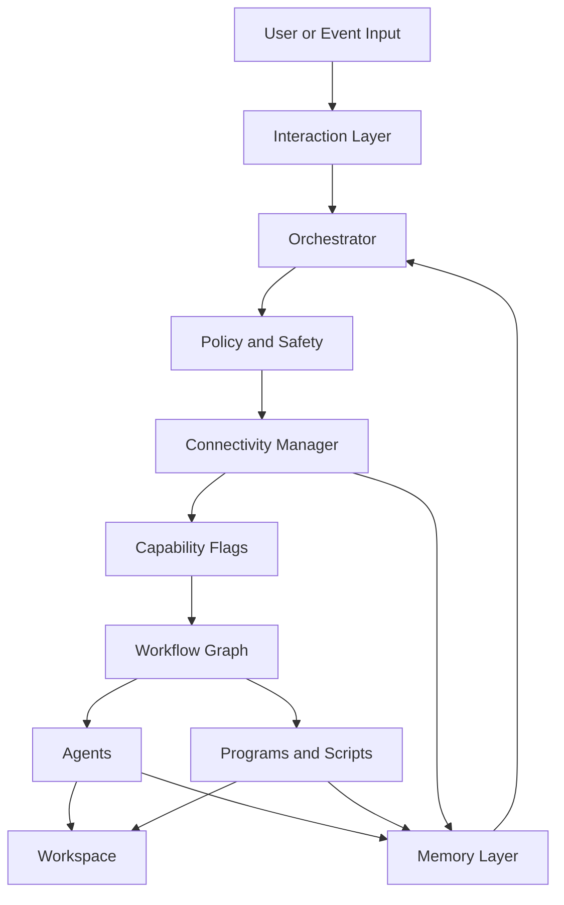

# Agentic OS Architecture

## Purpose

Skyforce is an agentic operating system modeled as a **living organism**. Every
component maps to a biological system, and every agent is grown from a shared
cellular template (see [cell_spec.md](../cell_spec.md)).

The system can:

- stay available locally with or without network access
- activate expanded capabilities when internet connectivity is present
- coordinate specialized agents through workflows, policies, memory, and tools
- continuously learn from completed runs

This document defines the target architecture, component boundaries, and execution model.

## Organism-to-Architecture Mapping

| Biological System | Architecture Component | Specification |
|---|---|---|
| Cell | Universal agent template | [cell_spec.md](../cell_spec.md) |
| DNA | Shared data schemas | [schemas.md](schemas.md) |
| Nervous system | Event bus | [event_bus_spec.md](event_bus_spec.md) |
| Immune system | Policy engine | [policy_engine_spec.md](../policy_engine_spec.md) |
| Brain + Spinal cord | Orchestration layer | This document, §2 |
| Sensory organs | Interaction layer | This document, §1 |
| Endocrine system | Connectivity activation | This document, §3 |
| Organs | Specialized agents | `docs/agents/*.md` |
| Muscles | Programs and scripts | `programs/`, `scripts/` |
| Long-term memory | Memory layer | This document, §6 |
| Skin + Skeleton | Project structure | `README.md` |

## Core Design Principle

The system is **offline-capable, online-amplified**.

- Offline mode provides local planning, file inspection, code generation, testing, and memory access.
- Online mode activates when connectivity is available and policy allows it.
- Internet connectivity should unlock remote research, package and dependency lookups, deployment, repo cloning, external APIs, and cross-system synchronization.
- Loss of connectivity should degrade gracefully, not stop the OS.

## System Layers

### 1. Interaction Layer

Handles how work enters the system.

Responsibilities:

- accept a product vision, repo path, task, failure log, or release request
- normalize requests into a standard job format
- surface progress, results, and blockers

Examples:

- "build this feature"
- "analyze this repository"
- "fix failing tests"
- "deploy when checks pass"

### 2. Orchestration Layer

The control plane for the agentic OS.

Responsibilities:

- choose the correct workflow
- sequence or parallelize agents
- manage retries, timeouts, and conditional branches
- track run state
- enforce policy and execution boundaries

Primary future component:

- `orchestrator`: central runtime that executes workflow graphs rather than only linear step lists

### 3. Connectivity Activation Layer

Determines whether the system can use online capabilities.

Responsibilities:

- detect internet availability
- expose a capability flag set such as `offline`, `online_read`, `online_write`, `deploy_enabled`
- gate workflows and tools based on connectivity and trust
- queue deferred work when offline and replay it when back online

Primary future component:

- `connectivity_manager`

This is the layer that "activates" the internet-enabled operating mode.

### 4. Agent Layer

A set of specialized cognitive workers with tight boundaries.

Current agents:

- `vision_agent`: converts product vision into structured features
- `coding_agent`: implements a scoped task with tests
- `debugging_agent`: diagnoses failures and proposes fixes
- `architecture_agent`: reviews structure, scale, security, and dependencies
- `learning_agent`: extracts patterns from completed runs

Recommended next agents:

- `planning_agent`: decomposes feature sets into ordered execution plans
- `testing_agent`: expands and validates test strategy across units, integration, and regression
- `security_agent`: reviews secrets, dependencies, permissions, and attack surface
- `deployment_agent`: prepares releases and verifies runtime health
- `connectivity_agent`: decides what online operations are worth doing when connectivity appears

### 5. Tool and Program Layer

Deterministic execution components used by agents and workflows.

Current examples:

- `programs/run_tests.sh`
- `programs/repo_scan.sh`
- `programs/dependency_scan.sh`
- `programs/deploy.sh`
- `scripts/task_split.py`

Responsibilities:

- wrap shell commands and local scripts
- produce machine-readable outputs
- keep side effects explicit
- remain simpler and more predictable than agent steps

### 6. Memory Layer

Stores operational history and reusable knowledge.

Current example:

- `memory/capability_store.json`

Recommended memory domains:

- `episodic memory`: run logs, failures, decisions, artifacts
- `semantic memory`: coding patterns, architectural guidance, known fixes
- `task memory`: active workflow state and resumable checkpoints
- `policy memory`: trusted repos, allowed tools, deployment gates

### 7. Policy and Safety Layer

A cross-cutting boundary around every action.

Responsibilities:

- enforce approval rules
- restrict destructive operations
- gate external network access
- require tests for code changes
- prevent unsafe deployment or secret leakage

This layer should sit above both agents and tools so every action is checked consistently.

## Runtime Modes

### Mode A: Local Offline

Allowed:

- read and analyze workspace files
- plan tasks
- write code
- run local tests
- update local memory

Deferred until connectivity returns:

- external documentation lookup
- dependency vulnerability lookups that need network
- repo cloning
- remote deployment
- external notifications

### Mode B: Connected

Adds:

- internet research
- remote repository operations
- dependency and security scanning against live sources
- cloud deployment
- synchronization of memory or artifacts

### Mode C: Restricted Connected

Internet exists, but policy narrows what is allowed.

Example:

- docs lookup allowed
- deployment blocked
- external write actions blocked

## Activation Model

When connectivity changes from unavailable to available:

1. `connectivity_manager` detects a stable online state
2. capabilities are recalculated
3. queued jobs are re-evaluated
4. orchestrator promotes eligible workflows into connected mode
5. agents gain access only to the newly allowed tools

When connectivity is lost:

1. running online tasks are checkpointed
2. nonessential online actions are paused or canceled
3. local-safe work continues
4. orchestrator records deferred actions for replay

## Target Execution Flow

## Workflow Architecture

The current YAML workflows are a strong starting point, but the target model should support richer graph behavior.

Current pattern:

- sequential steps
- parallel coding fan-out
- single conditional debug branch

Target pattern:

- reusable workflow templates
- event-driven triggers
- resumable steps
- explicit inputs and outputs for each node
- policy checks between nodes
- connectivity-aware branches

Recommended workflow types:

- `feature_pipeline`: vision to shipped feature
- `repo_evaluation`: scan and architecture review
- `failure_recovery`: test failure to fix to re-test
- `release_pipeline`: security, validation, deploy
- `connectivity_resume`: replay deferred online work

## Proposed Component Map

### Existing Components

- agent definitions in `docs/agents/`
- workflow definitions in `workflows/`
- deterministic tools in `programs/` and `scripts/`
- long-term memory seed in `memory/`

### Missing Components To Add

- `runtime/orchestrator.py` or equivalent runner
- `runtime/connectivity_manager.py`
- `runtime/policy_engine.py`
- `runtime/job_store.py`
- `runtime/event_bus.py`
- `schemas/` for workflow I/O contracts
- `artifacts/` for run outputs and checkpoints
- `logs/` for structured execution traces

## Agent Boundaries

Each agent should stay narrow.

- Vision agents interpret intent.
- Planning agents decompose and prioritize work.
- Coding agents change code and tests.
- Debugging agents work from failures and traces.
- Architecture agents evaluate structure and risk.
- Learning agents update reusable knowledge.

Important rule:

No single agent should own the full lifecycle alone. The operating system should compose agents, not rely on one general worker doing everything.

## Data Contracts

The OS should move from plain-text handoffs toward structured artifacts.

Recommended artifacts:

- `feature_plan.json`
- `tasks.json`
- `test_results.json`
- `vuln_report.json`
- `run_state.json`
- `deferred_actions.json`
- `architecture_report.json`

This will make the system easier to resume, audit, and automate.

## Reliability Requirements

- every workflow step should emit status and artifacts
- failures should be recoverable from checkpoints
- agent outputs should be validated before downstream use
- online operations should be retried with backoff
- workflows should be resumable after process restart

## Security Requirements

- all internet-enabled actions must be explicitly gated
- secrets must live outside prompts and versioned docs
- deployment must require passing validation checks
- external writes should be separated from external reads
- trusted-source rules should exist for online research

## Suggested Near-Term Roadmap

### Phase 1: Formalize the OS Skeleton

- add runtime modules for orchestration, policy, and connectivity
- standardize workflow input and output files
- write structured artifact files instead of only plain text outputs

### Phase 2: Make Connectivity First-Class

- implement connectivity detection
- add deferred action queues
- introduce connected and offline execution branches in workflows

### Phase 3: Expand Specialized Agents

- add planning, testing, security, and deployment agents
- route tasks to the smallest capable agent

### Phase 4: Learn and Improve

- persist run summaries and successful fixes
- use learning outputs to improve planning and debugging quality

## Architecture Summary

Skyforce should become an **event-driven, workflow-based, policy-governed agentic OS** with:

- a local execution core
- a connectivity activation layer
- specialized agents with clear boundaries
- deterministic tools for side effects
- persistent memory and resumable state

The key idea is not "agents only." It is **agents + orchestration + policy + memory + connectivity-aware execution**.
