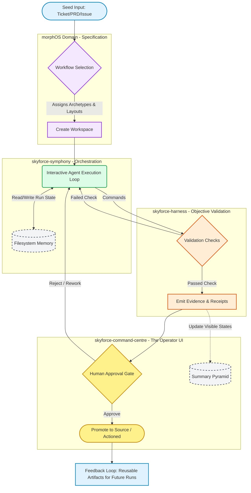
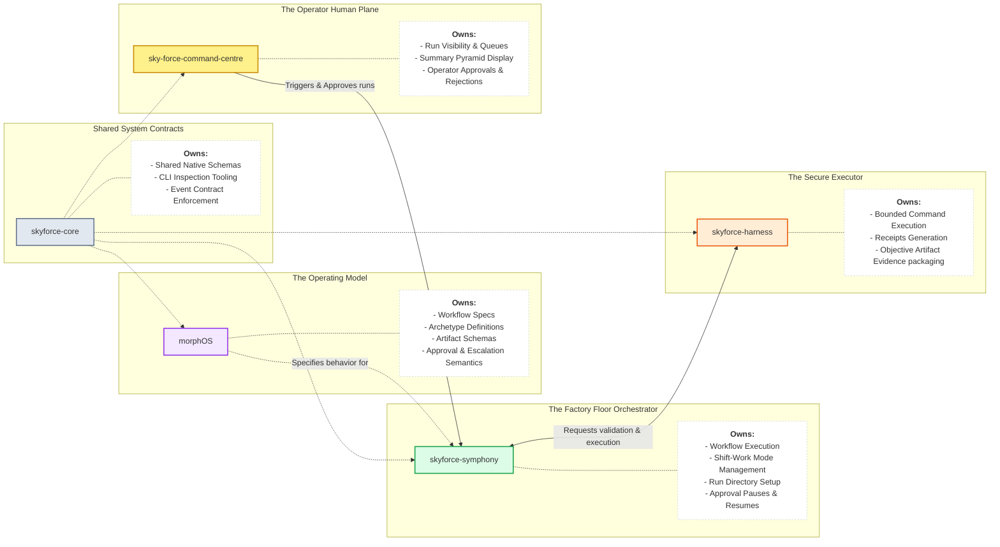

# Topic 1: System Overview

These diagrams visualize the complete user journey and how technical responsibilities are divided across the Skyforce platform to operate the `morphOS` factory.

## 1.1 The AI Software Factory Loop Overview

This flowchart traces the end-to-end journey from the moment an operator submits a task ("seed") to the final approved promotion. It highlights how the work moves from orchestration to validation and finally into human review.

***

## 1.2 System Architecture & Boundaries

This diagram breaks down the strict responsibility boundaries of the platform. `morphOS` is not a standalone runtime; it dictates the *rules*, while Symphony, Harness, and Core provide the *engine*.

