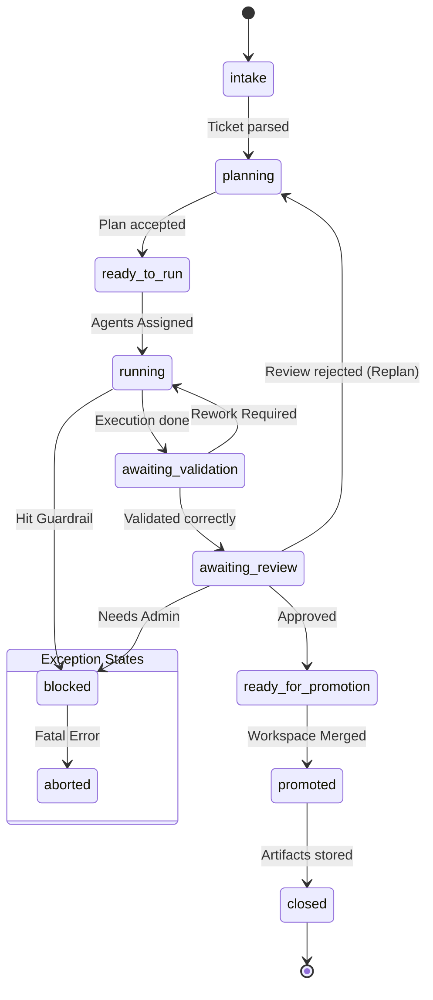
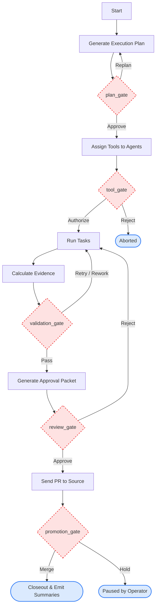

# Topic 2: Control Flow & Delivery Lifecycle

These diagrams map out the 8-phase factory loop defined in the `morphOS` specification. They focus on transitions and human-intervention controls.

## 2.1 The 8-Phase Factory Loop

This shows the canonical baseline life of a successful run without deep details of failures. It focuses on handoffs between Planning, Execution, and Validation.

```mermaid
flowchart LR
    %% Styling
    classDef intake fill:#e0f2fe,stroke:#0284c7,stroke-width:2px;
    classDef planning fill:#f3e8ff,stroke:#9333ea,stroke-width:2px;
    classDef execution fill:#ffedd5,stroke:#ea580c,stroke-width:2px;
    classDef review fill:#fef08a,stroke:#ca8a04,stroke-width:2px;
    classDef complete fill:#dcfce7,stroke:#16a34a,stroke-width:2px;

    A(Intake):::intake --> B(Planning):::planning
    B --> C(Assignment):::planning
    C --> D(Execution):::execution
    D --> E(Validation):::execution
    E --> F(Review):::review
    F --> G(Promotion):::review
    G --> H(Closeout):::complete
```

***

## 2.2 Factory Control States (State Machine)

This state diagram tracks the high-level `status` of a workflow. Note the fallback `Blocked` and `Aborted` states which can trigger from anywhere if a policy fails or an operator intervenes.

***

## 2.3 Gates & Human Interventions

This zooms in on the explicit control points where operators or strict policies intervene, pausing the autonomous execution.

