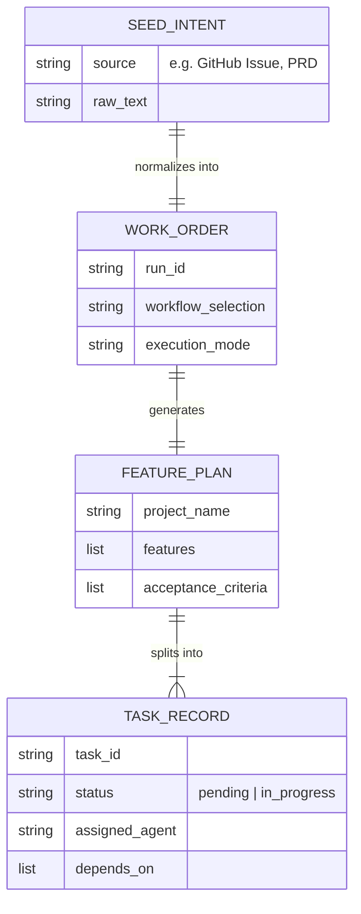
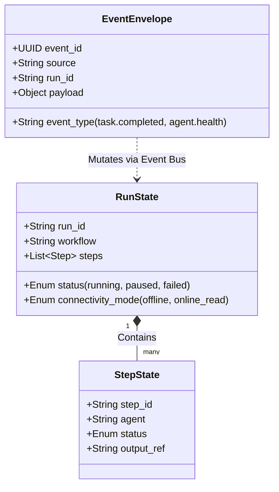
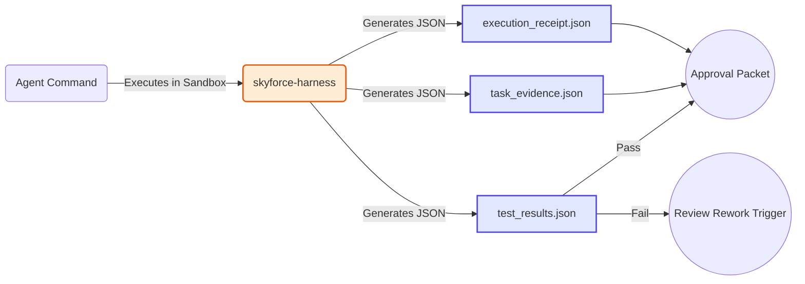
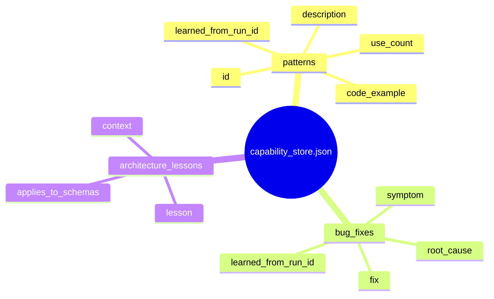

# Topic 3: Core Data Schemas (The "DNA")

These diagrams illustrate the actual structural JSON contracts defined in `schemas.md` and the MVP documents that flow between phases.

## 3.1 Task Intake & Translation

This Entity Relationship diagram shows how unstructured seed intent breaks down into specific data types to be picked up by the Coding agents.

***

## 3.2 Runtime Execution Context & Event Bus

This block visualizes the `Event Envelope` system and the central `Run State` which the Orchestrator tracks so that all agents have a source of truth for the workflow.

***

## 3.3 Execution Receipts & Evidence

When agents invoke tools or run code, `skyforce-harness` safely traps the execution, determines success, and emits standard receipts that the agents can read later.

***

## 3.4 The Capability Store & Learning

When a run ends, `morphOS` extracts lessons and saves them into the `capability_store.json` so downstream runs don't make the same mistakes or recreate the same boilerplate.

