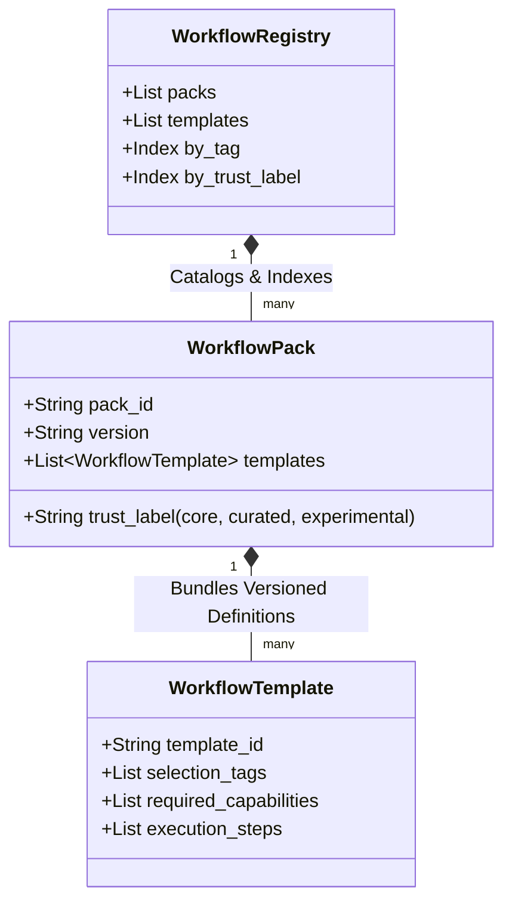
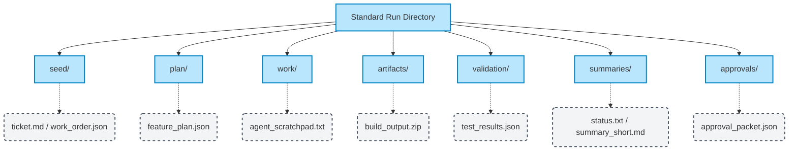
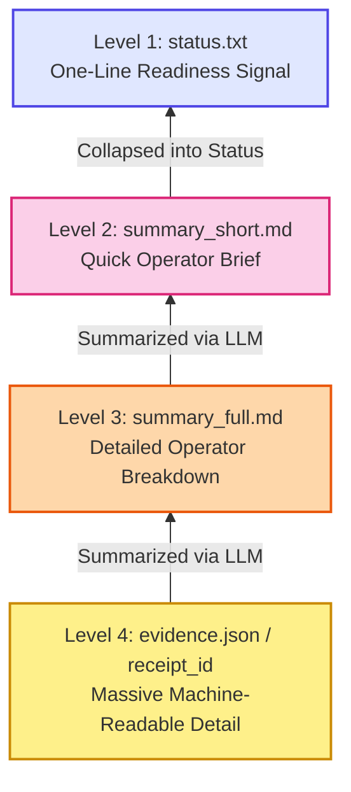
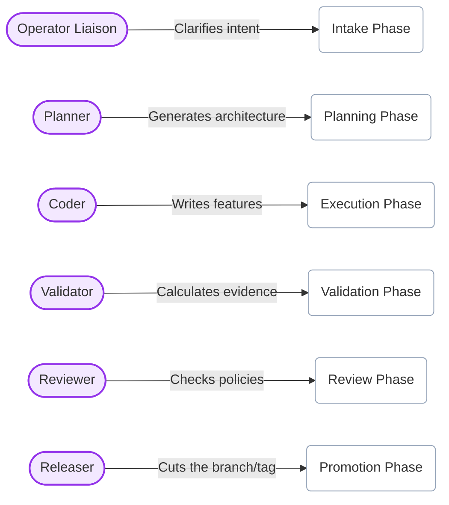
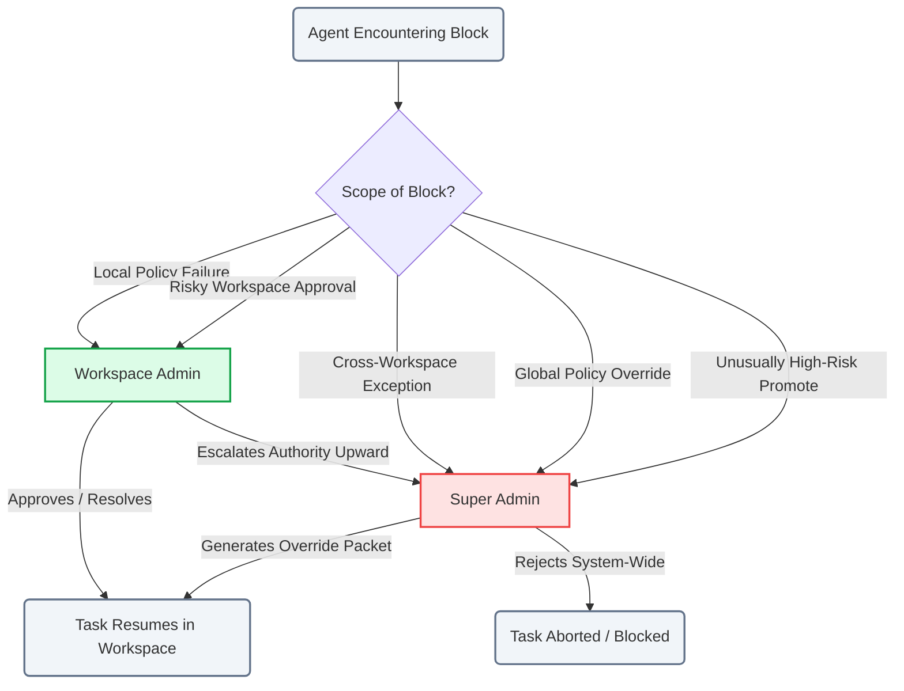

# Topic 4: Workflows & Resource Topologies

## 4.1 Workflow Pack & Registry Hierarchy

Workflows do not float independently. They are versioned and distributed in governed "Packs" loaded into the "Registry." This diagram shows how the runtime discovers the correct execution template.

***

## 4.2 Filesystem Memory Topology

In standard agents, memory is hidden in LLM context windows. In `morphOS`, memory is explicitly dumped to the filesystem so both agents and operators can read it. Here is the canonical run directory structure.

***

## 4.3 The Summary Pyramid

To allow agents to instantly understand past work without blowing out their context window (and to give human operators quick insight), every run must emit a "compression pyramid."

***

# Topic 5: Actors & Authorities

## 5.1 Agent Archetype Responsibilities

Agents are not monolithic. `morphOS` maps different behaviors and tool permissions to specific named **Archetypes** that correspond to the phases in the 8-Phase Factory Loop.

***

## 5.2 The Durable Authority Boundary

When an agent hits a wall it cannot safely navigate, or when a policy gate is explicitly locked, authority escalates to human layers strictly defined by their scope.

